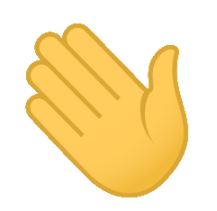

# Hi there  This is Jianpeng ！✨ 
# About me🌽

Welcome to my Github page! I am ZhaoJianpeng and I am currently Learning NLP and C++!  

#### 🌱 Things I am currently working on 🌱 : 
- deep learning
- Programming competition learning
- AIGC learning
- Basic algorithm learning on acwing

### 🏃Personal skill advantages 🔥
- Proficient in C/C++, Python, and other languages.

#### ⚡ Things recent ones I'm interested in ⚡ : 
- NLP
- Chat GPT
- Codeforce
- Programming competition

