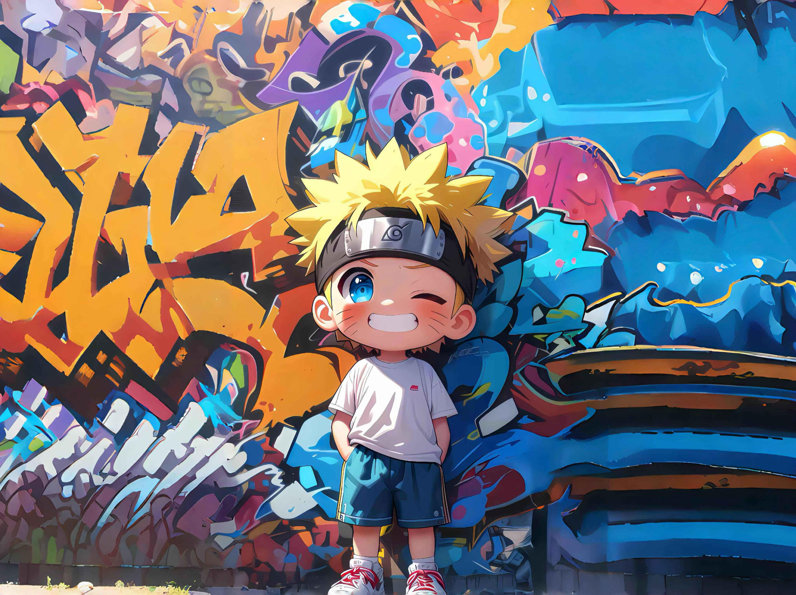

# Hi there 👋 This is Jianpeng ！✨ 

# About me🌽

Welcome to my Github page! I am ZhaoJianpeng and I am currently Learning NLP and C++!  

#### 🌱 Things I am currently working on 🌱 : 
- 一名普通本科生
- C++算法竞赛
### 🏃Personal skill advantages 🔥
- 熟练 Python、C/C++等

#### ⚡ Things recent ones I'm interested in ⚡ : 
- Chat GPT
- C++算法竞赛
- NLP
- Codeforce
